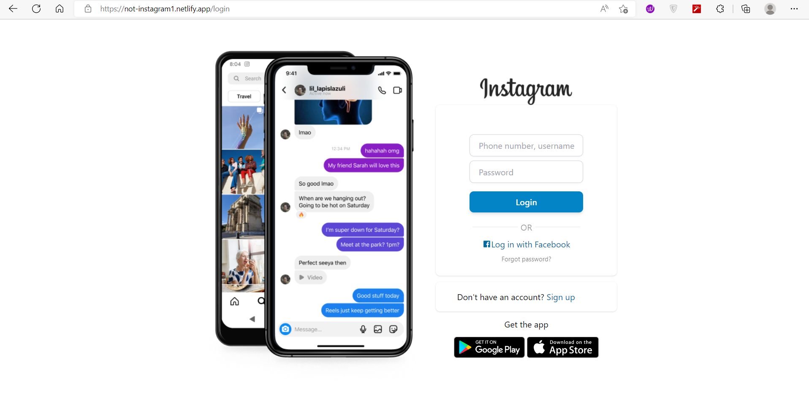

<a name="readme-top"></a>


<!-- PROJECT LOGO -->
<br />
<div align="center">
  <a href="https://github.com/MrSingh2000/insta_clone">
    
  </a>

  <h3 align="center">Not Instagram</h3>

  <p align="center">
    MERN Stack Instagram clone
    <br />
    <a href="https://not-instagram1.netlify.app/">View Demo</a>
    ·
    <a href="https://github.com/MrSingh2000/insta_clone/issues">Report Bug</a>
    ·
    <a href="https://github.com/MrSingh2000/insta_clone/issues">Request Feature</a>
  </p>
</div>

<!-- TABLE OF CONTENTS -->
<details>
  <summary>Table of Contents</summary>
  <ol>
    <li>
      <a href="#about-the-project">About The Project</a>
      <ul>
        <li><a href="#built-with">Built With</a></li>
      </ul>
    </li>
    <li>
      <a href="#getting-started">Getting Started</a>
      <ul>
        <li><a href="#prerequisites">Prerequisites</a></li>
        <li><a href="#installation">Installation</a></li>
      </ul>
    </li>
    <li><a href="#contact">Contact</a></li>
  </ol>
</details>

<!-- ABOUT THE PROJECT -->

## About The Project

<a href="https://not-instagram1.netlify.app/">

</a>

An Instagram clone made using MERN stack immitating various features of Instagram.

Features covered :-

- Login / Signup page clones
- Update profile picture and upload Posts, using Azure Cloud Services
- Search for Registered users via usernames in real time.
- Follow and Following features.
- One on One private Messaging via Socket.io

If you wanna add your taste to the existing application, feel free to fork the repo and just start working on your local machine!

<p align="right">(<a href="#readme-top">back to top</a>)</p>

### Built With

- [](https://reactjs.org/)
- [](https://www.mongodb.com/)
- [](http://expressjs.com/)
- [](https://nodejs.org)

### Other Technologies

- [](https://azure.microsoft.com)

<p align="right">(<a href="#readme-top">back to top</a>)</p>

<!-- GETTING STARTED -->

## Getting Started

Set up the project locally on your system following instructions on setting up your project.
To get a local copy up and running, follow these simple steps.

### Prerequisites

Installing latest Package Manager

- npm
  ```sh
  npm install npm@latest -g
  ```
- yarn
  ```sh
  yarn install yarn@latest -g
  ```

### Installation

1. Clone the repo
   ```sh
   git clone https://github.com/MrSingh2000/insta_clone.git
   ```
2. Installing required packages
    
   Server 
   ```sh
   npm install
   ```
   Client 
   ```sh
   cd client
   npm install
   ```
   Socket Server 
   ```sh
   cd socket_server
   npm install
   ```

3. Setting up environment variables in `.env`

   Server side env variables
   ```txt
   JWT_SECRET = 'your_API_key_here'
   MONGODB_URI = 'your_MONGO_URI_here'
   AZURE_SAS_URL = 'your_AZURE_SAS_URL_here'
   AZURE_CONTAINER = 'your_AZURE_CONTAINER_NAME_here'
   AZURE_CONNECTION_STRING = 'your_AZURE_CONNECTION_STRING_here'
   ```

   Server side env variables
   ```txt
   REACT_APP_HOST = 'BACKEND_HOST_URL'
   REACT_APP_SOCKET_HOST = 'SOCKET_BACKEND_HOST_URL'
   ```

4. Start the application

   server
   ```sh
   node index.js && node socket.js
   ```
   client
   ```sh
   npm run start
   ```

<p align="right">(<a href="#readme-top">back to top</a>)</p>

<!-- CONTACT -->

## Contact

[](https://www.linkedin.com/in/anshuman-singh-856991201/)

[](https://github.com/MrSingh2000)

[](https://www.instagram.com/mr_singh2000/)

<p align="right">(<a href="#readme-top">back to top</a>)</p>

<!-- MARKDOWN LINKS & IMAGES -->
<!-- https://www.markdownguide.org/basic-syntax/#reference-style-links -->

[contributors-shield]: https://img.shields.io/github/contributors/MrSingh2000/weather-app-android.svg?style=for-the-badge
[contributors-url]: https://github.com/MrSingh2000/weather-app-android/graphs/contributors
[forks-shield]: https://img.shields.io/github/forks/MrSingh2000/weather-app-android.svg?style=for-the-badge
[forks-url]: https://github.com/MrSingh2000/weather-app-android/network/members
[stars-shield]: https://img.shields.io/github/stars/MrSingh2000/weather-app-android.svg?style=for-the-badge
[stars-url]: https://github.com/MrSingh2000/weather-app-android/stargazers
[issues-shield]: https://img.shields.io/github/issues/MrSingh2000/weather-app-android.svg?style=for-the-badge
[issues-url]: https://github.com/MrSingh2000/weather-app-android/issues
[license-shield]: https://img.shields.io/github/license/MrSingh2000/weather-app-android.svg?style=for-the-badge
[license-url]: https://github.com/MrSingh2000/weather-app-android/blob/master/LICENSE.txt
[linkedin-shield]: https://img.shields.io/badge/-LinkedIn-black.svg?style=for-the-badge&logo=linkedin&colorB=555
[linkedin-url]: https://linkedin.com/in/othneildrew
[product-screenshot]: readme/spash.jpg
[product-homepage]: readme/2.jpg
[native]: https://img.shields.io/badge/ReactNative-20232A?style=for-the-badge&logo=react&logoColor=61DAFB
[react.js]: https://img.shields.io/badge/React-20232A?style=for-the-badge&logo=react&logoColor=61DAFB
[react-url]: https://reactjs.org/
[native-url]: https://reactnative.dev/
